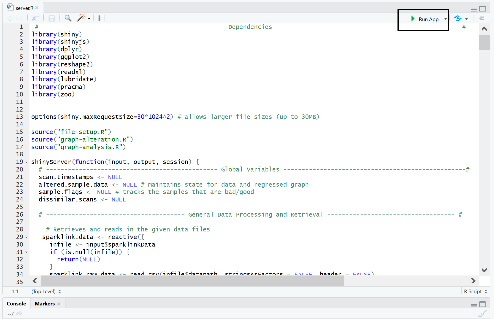
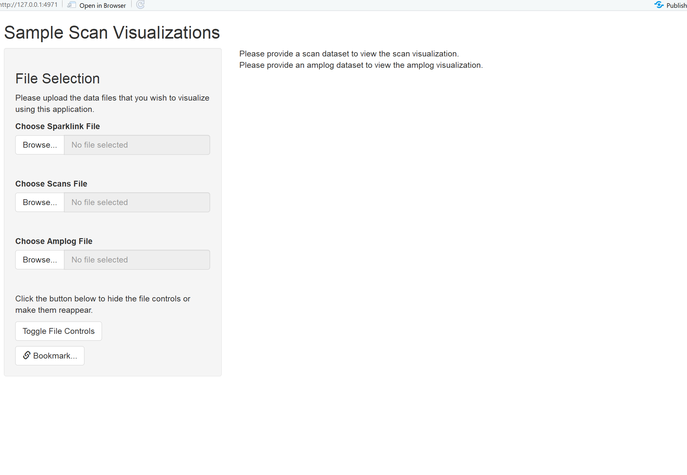
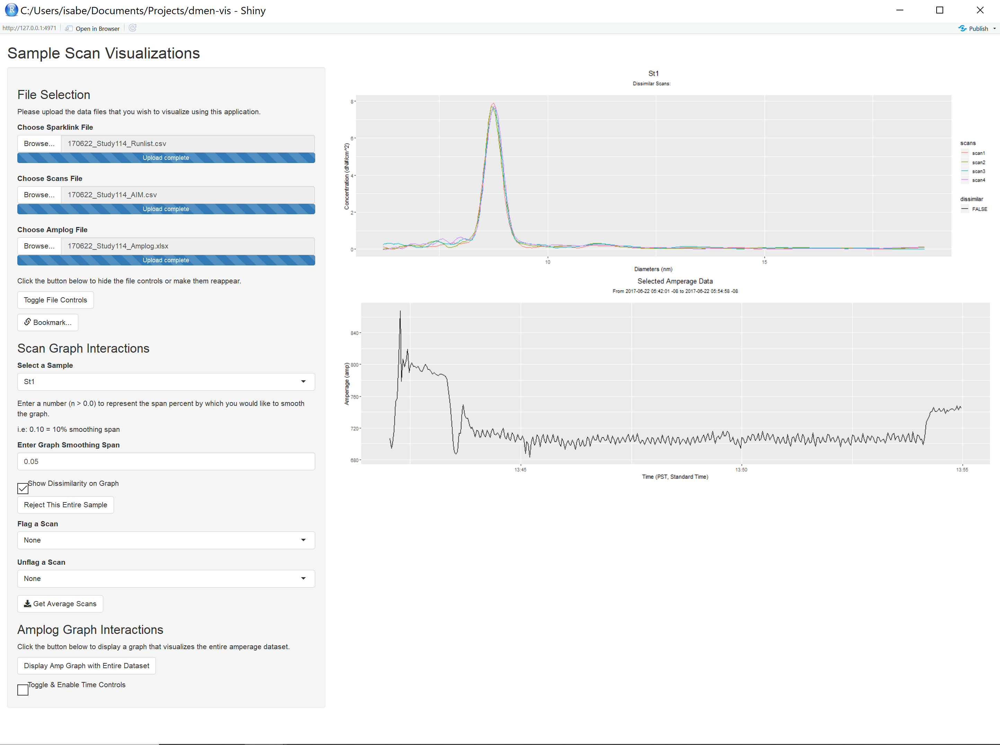

## Run Instructions
To run this application, `git clone` this project and open `server.R` in `RStudio`.
In the upper left corner of the source window, click `Run App`.

The following window should open.

Upload the test files in `data/`. You should see the following graphs appear.

## Dependencies

This app requires an `R` installation with a version >= 3.5.
All of the packages listed below must be installed.

* `shiny`
* `shinyjs`
* `dplyr`
* `ggplot2`
* `readxl`
* `lubridate`
* `pracma`
* `zoo`
